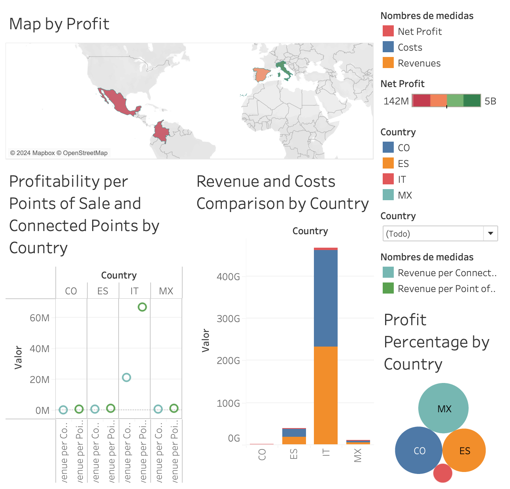
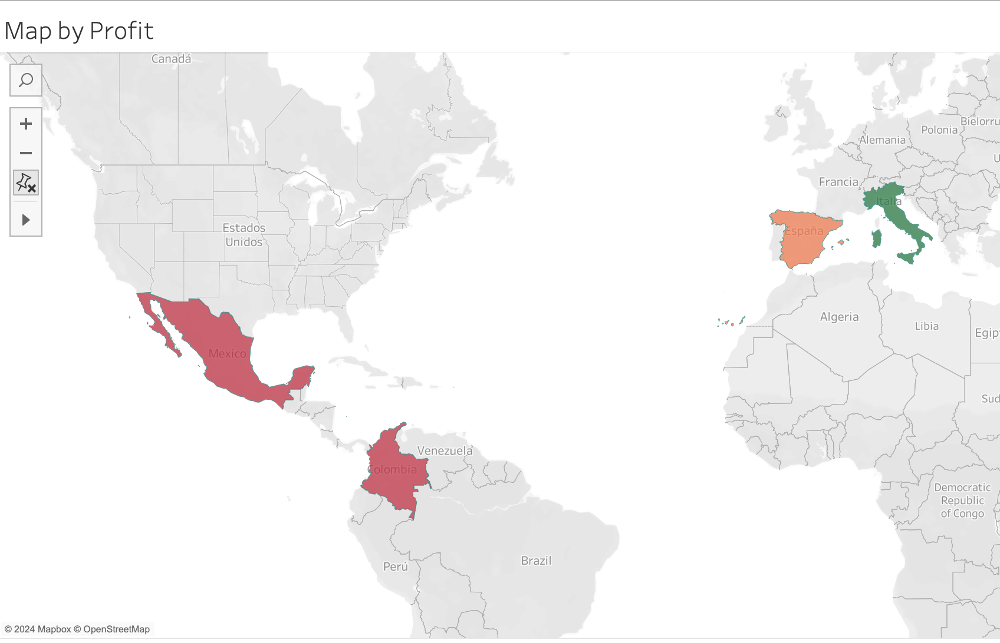
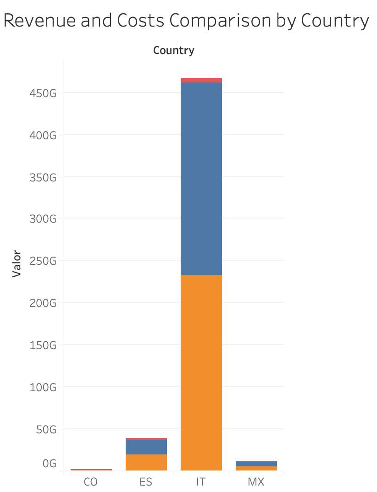
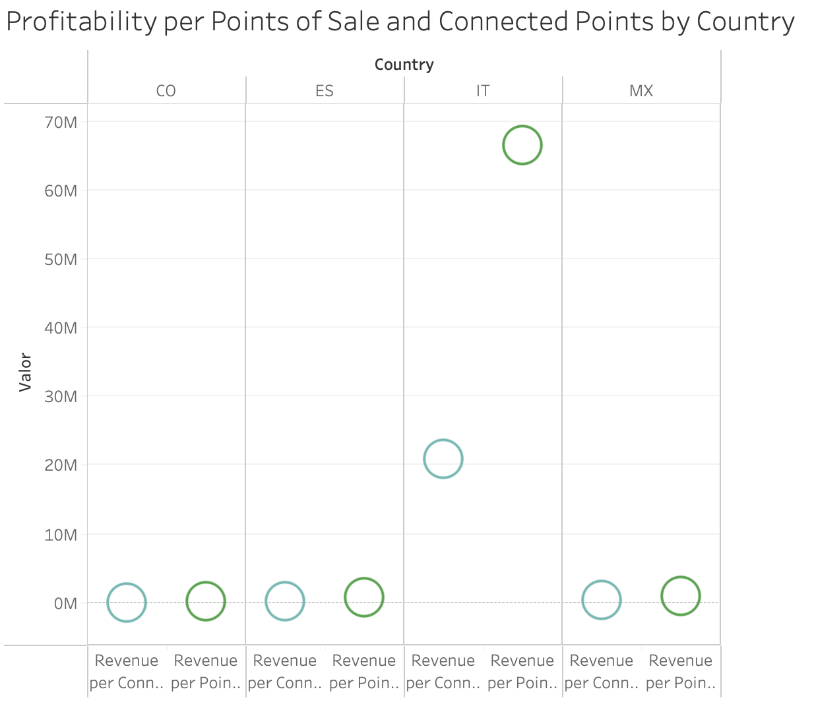
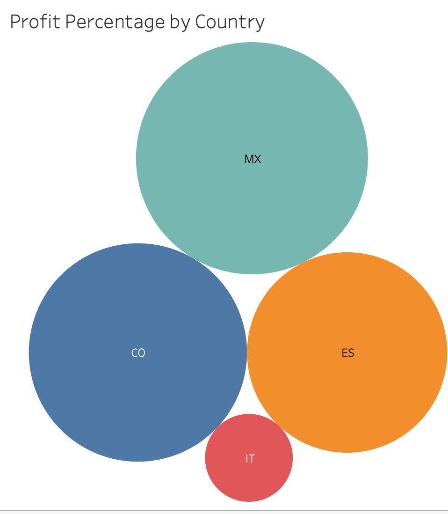

# Project 2: Business Analytics for IronHack Media

## Overview
This project analyzes key performance indicators (KPIs) from the early years of a startup acquired by IronHack, focusing specifically on performance metrics across different countries. The objective is to identify which regions are most profitable and how different operational metrics correlate with business success.

## Key Metrics and Calculated Fields
The following calculated fields were used to understand and compare business performance across different countries:

- **Net Profit**: Calculated as `Revenues - Costs`. This metric helps in understanding the bottom line profitability of operations in each country.
- **Profit per Connected Point**: `SUM(Net Profit) / SUM(Connected Points)`. Measures profitability relative to the number of connected service points, offering insights into operational efficiency.
- **Profit per Point of Sale**: `SUM(Net Profit) / SUM(Points of Sale)`. This indicates the profitability generated per sales outlet, useful for assessing sales efficiency.
- **Profit Percentage**: `(SUM(Revenues) - SUM(Costs)) / SUM(Costs) * 100`. A key performance ratio showing profit as a percentage of costs, illustrating how effectively a country is managing its expenditures relative to generated revenues.
- **Revenue per Connected Point**: `SUM(Revenues) / SUM(Connected Points)`. This shows the revenue efficiency per connected point, providing insight into how well the infrastructure is utilized to generate revenue.
- **Revenue per Point of Sale**: `SUM(Revenues) / SUM(Points of Sale)`. This metric evaluates the revenue generation capability of each sales point.

## Complete Dashboard Overview
The comprehensive dashboard provides an integrated view of all key metrics and visualizations to assess the performance across different countries in one glance.

## Investment and Return Analysis
Interestingly, higher investments do not always correlate with higher returns. For instance, in countries like Mexico and Colombia, where investment is relatively lower, the return on investment is significantly higher.

| Country   | Net Profit (in USD) | Profit Percentage |
|-----------|---------------------|-------------------|
| Mexico    | 801,449,049         | 15.70%            |
| Colombia  | 141,904,163         | 13.89%            |
| Spain     | 2,032,186,830       | 11.69%            |
| Italy     | 5,129,993,614       | 2.25%             |

This indicates that strategic, rather than voluminous, investment might yield better financial outcomes.

## Sales Points and Revenue Analysis
The data shows that having a higher number of sales or connected points does not necessarily translate into higher revenue or profit. For example, while Italy has the highest revenue and costs, Spain has the most connected points and points of sale, yet does not lead in profitability or revenue generation.

## Dashboard Visualizations

### 1. Map by Profit

The map provides a geographical visualization of net profit across different countries, indicating where the company is generating most of its profits.

### 2. Revenue and Costs Comparison by Country

This visualization compares the total revenues and costs per country, helping to identify which regions contribute most to the bottom line.

### 3. Profitability per Points of Sale and Connected Points by Country

This detailed analysis correlates the number of points of sale and connected points with the profitability in each country, offering a granular view on operational effectiveness.

### 4. Profit Percentage by Country

The bubble chart displays profit percentages by country, clearly depicting which regions are more efficient in turning their costs into profits.

## Conclusions
From the analysis, it is evident that:
- Some countries are significantly more profitable than others, indicating potential areas for increased investment or strategic focus.
- The correlation between the number of sales points and profitability varies significantly by country, suggesting that some regions might benefit from a different operational strategy or resource allocation.

## Recommendations
Based on the findings, the following recommendations are proposed:
1. Prioritize investment in regions showing higher profitability to leverage and expand on successful strategies.
2. Conduct a deeper analysis into regions with lower profitability to understand the causes and implement necessary operational adjustments.
3. Continue monitoring the performance metrics used in this analysis to track the impact of implemented changes over time.
