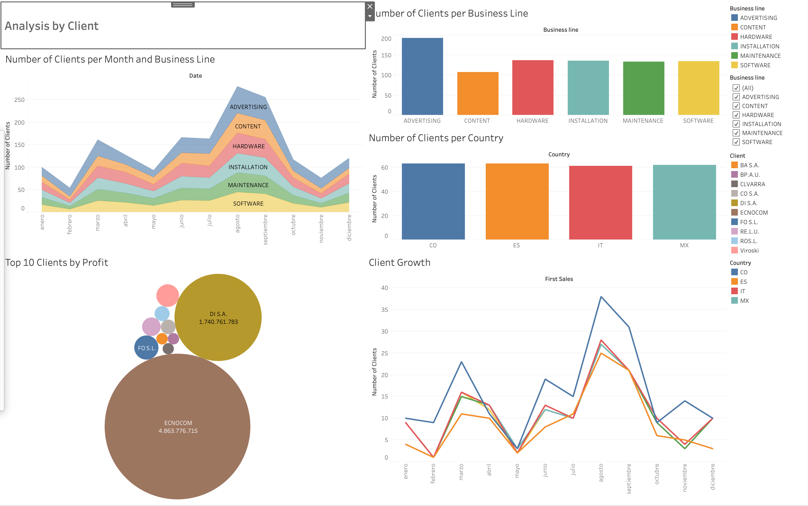
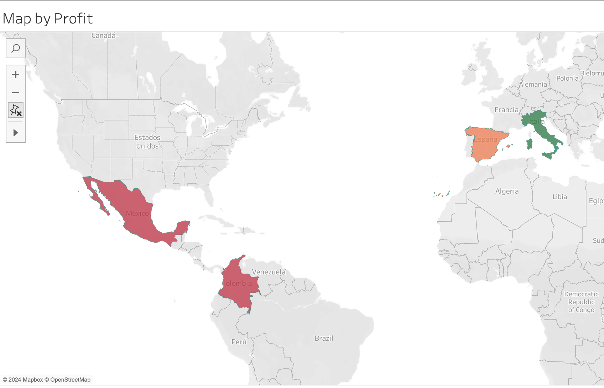

# Business Analytics Challenge for IronHack Media (Project 2)

## Introduction
This project explores a dataset containing key performance indicators (KPIs) from the early years of a startup acquired by IronHack. Using advanced data processing with Pandas and Python, along with visualizations created in Tableau, we aim to uncover insights into the company's operational performance across various dimensions.

## Team Members
- [cristinagil02](https://github.com/cristinagil02)
- [JReuman1](https://github.com/JReuman1)
- [kurtisjw](https://github.com/kurtisjw)
- [mgparallel](https://github.com/mgparallel)

## Data Preparation
Before diving into the analyses, significant data cleaning was performed to enhance data quality and usability:
- **Data Cleaning**: Addressed missing values, corrected data inconsistencies, and removed duplicate entries to ensure data integrity.
- **Creating a New ID**: Developed a unique identifier for each record by concatenating country, business line, and client fields. This ID helped streamline our analyses and supported accurate data merging and manipulation.

## Descriptive Analysis
The comprehensive descriptive analysis of the startup’s data covers the following aspects:

### Analysis by Client
- **Objective**: Understand the startup's performance in relation to individual clients.
- **Methods**: Analysis involves identifying trends, patterns, and anomalies specific to client-related KPIs.
- **Findings**: 
  - Business lines like Advertising and Hardware show a higher number of clients, whereas Content has fewer but more valuable clients.
  - Periodic drops in client engagement, especially pronounced towards the year-end.
  - Notable peak in new clients during summer, followed by a significant reduction.
  - The client Ecnocom alone is worth more than all other clients combined, indicating a dependency on a single major client.
- **Visualization**: 
  - 

### Analysis by Country
- **Objective**: Evaluate the startup's business performance across different countries.
- **Methods**: Comparative analysis of KPIs across various countries.
- **Findings**:
  - Different countries show varying levels of profitability and cost efficiency.
  - Countries like Mexico and Colombia show higher returns on lower investments compared to Spain and Italy.
  - 

### Analysis by Business Line
- **Objective**: Assess the performance of different business lines within the startup.
- **Methods**: Evaluation of profitability and potential areas for improvement across business lines.
- **Findings**:
  - Advertising and Software are highly profitable with substantial client bases.
  - Content shows high profitability but needs to manage costs effectively, especially during certain quarters.
  - Hardware demonstrates high revenue but suffers from low ROI due to high maintenance costs.
  - Installation and Maintenance have below-average profits, indicating inefficiencies.
  - 

### Additional Relevant Analysis
- **Objective**: Conduct further analyses to gain deeper insights into the business data.
- **Findings**:
  - **Customer Retention Rate**: Analyzed the rate at which existing customers have continued to do business over a given period. This metric helped identify the effectiveness of customer relationship management strategies.
  - Seasonal trends significantly affect profit margins, especially noticeable in Content and Hardware business lines.
  - Operational inefficiencies in Installation and Maintenance could be improved to convert high activity into higher profits.
  - Strategic investment in profitable regions and business lines could enhance overall business efficiency and profitability.

### Investment and Return Analysis
Interestingly, higher investments do not always correlate with higher returns. Strategic investments tend to yield better financial outcomes.

| Country   | Net Profit (in USD) | Profit Percentage |
|-----------|---------------------|-------------------|
| Mexico    | 801,449,049         | 15.70%            |
| Colombia  | 141,904,163         | 13.89%            |
| Spain     | 2,032,186,830       | 11.69%            |
| Italy     | 5,129,993,614       | 2.25%             |

## Strategic Recommendations
Based on the data-driven insights from our analyses, we propose the following strategic recommendations for IronHack Media:
1. **Invest in High-Performance Areas**: Prioritize investment in business lines and countries showing high profitability to maximize returns.
2. **Address Underperformance**: Conduct deep dives into less profitable business lines and operational areas to identify and rectify the root causes of inefficiencies.
3. **Enhance Customer Retention**: Develop and implement strategies to improve customer retention rates, leveraging insights from the customer retention analysis.
4. **Continuous Monitoring and Adaptation**: Implement a continuous monitoring system to track the performance of all business lines and adapt strategies based on real-time data.

## Conclusion
Our exhaustive analysis not only showcases our capability to dissect and understand complex datasets but also our ability to translate these insights into actionable strategic recommendations. We believe that these recommendations, if implemented, could significantly enhance the operational efficiency and profitability of IronHack Media.

## How to Contribute
Contributions to this project are welcome. Interested parties can collaborate by reviewing our code, proposing enhancements, or participating in discussions to further the analysis.

Good luck to all participants, and may our insights lead to substantial improvements in IronHack Media's business operations.
